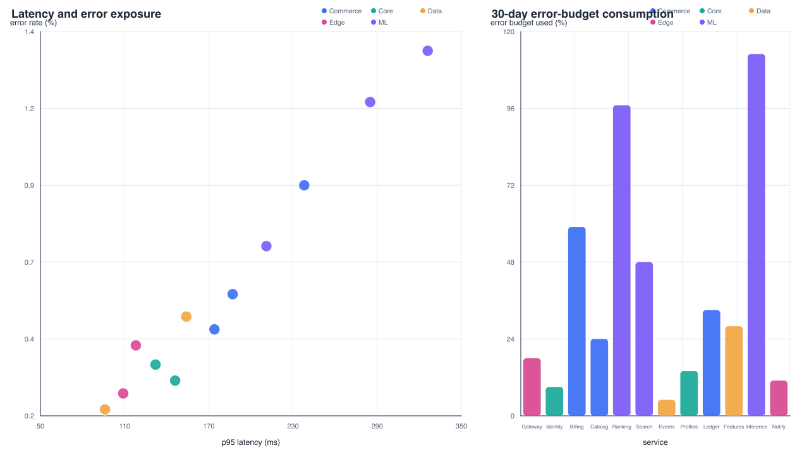
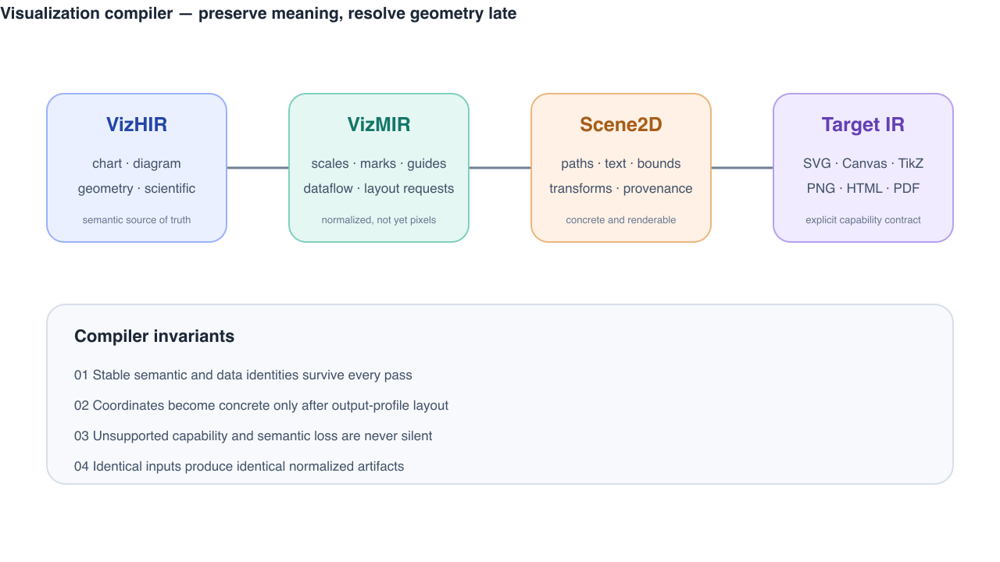

# VizIR

VizIR is an experimental, deterministic visualization compiler. Its editable
source is a semantic `.viz.yaml` document; generated MIR and Scene2D are
inspectable build artifacts.

```text
VizHIR -> validated document -> VizMIR -> Scene2D -> capability report -> target
```

The MVP deliberately supports three dialect families instead of pretending one
renderer can understand every visual system:

- `chart.scatter`, `chart.line`, and `chart.bar`;
- `diagram.graph` with deterministic layered or manual layout;
- `geometry.scene` with typed groups, shapes, text, paths, and transforms.

PNG is a first-class delivery format and defaults to a transparent background.
SVG remains the exact, inspectable target. PNG rasterization uses
`rsvg-convert`, with ImageMagick as a fallback.

## Quick start

```bash
just install

cargo run -p vizir-cli -- validate examples/chart/service-health.viz.yaml

cargo run -p vizir-cli -- normalize \
  examples/chart/service-health.viz.yaml \
  --output out/service-health.mir.json

cargo run -p vizir-cli -- render \
  examples/chart/service-health.viz.yaml \
  --format png \
  --background transparent \
  --output out/service-health.png \
  --manifest out/service-health.manifest.json
```

Use `vizir explain <file> --node <stable-id>` to inspect why a Scene2D node
exists, and `vizir capabilities <backend>` to inspect output support.

The executable contracts can be emitted directly from the Rust model:

```bash
vizir schema mir --output schemas/viz-mir.schema.json
vizir schema scene-patch --output schemas/scene-patch.schema.json
vizir schema capability --output schemas/capability.schema.json
```

## Current boundary

VizIR owns schema validation, normalization, lowering, layout, stable identity,
provenance, capability reporting, Scene2D construction, and artifact emission.
It does not own natural-language intent interpretation or backend routing; that
remains the responsibility of the `create-plot` skill.

Interaction, animation, Scene3D, external layout providers, native TikZ, and
large columnar instance buffers are planned dialect/runtime extensions, not
MVP placeholders hidden behind generic enums.

See [the IR family contract](docs/ir-family.md) for the ownership boundary,
stable 0.1 surface, and promotion rules.

## Executable reference gallery

Every gallery PNG is built from the adjacent semantic example and retains a
transparent alpha channel. These are scenario references, not isolated shape
smokes.

| Scenario | Semantic source | Rendered reference |
| --- | --- | --- |
| Service reliability dashboard | `examples/chart/service-health.viz.yaml` | `gallery/service-health.png` |
| Multi-series incident recovery | `examples/chart/incident-latency.viz.yaml` | `gallery/incident-latency.png` |
| Model evaluation comparison | `examples/chart/model-evaluation.viz.yaml` | `gallery/model-evaluation.png` |
| Regional revenue bindings | `examples/chart/sales-regions.viz.yaml` | `gallery/sales-regions.png` |
| Agent compiler runtime | `examples/diagram/agent-runtime.viz.yaml` | `gallery/agent-runtime.png` |
| Streaming data platform | `examples/diagram/data-platform.viz.yaml` | `gallery/data-platform.png` |
| Automatic dialect lowering layout | `examples/diagram/dialect-lowering.viz.yaml` | `gallery/dialect-lowering.png` |
| Compiler invariant poster | `examples/geometry/compiler-pipeline.viz.yaml` | `gallery/compiler-pipeline.png` |
| Visual grammar map | `examples/geometry/visual-grammar.viz.yaml` | `gallery/visual-grammar.png` |
| Mixed reliability brief | `examples/mixed/reliability-brief.viz.yaml` | `gallery/reliability-brief.png` |




