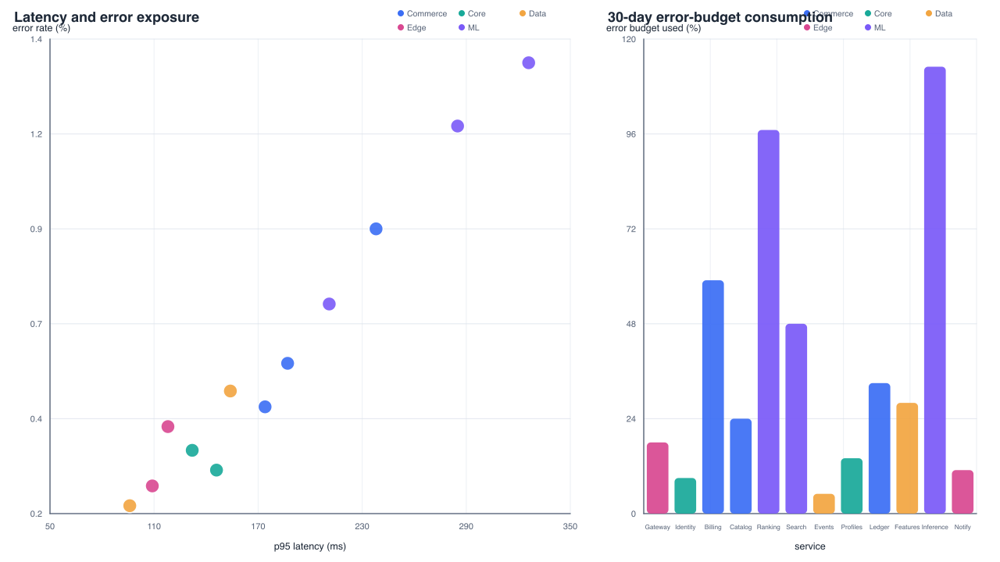
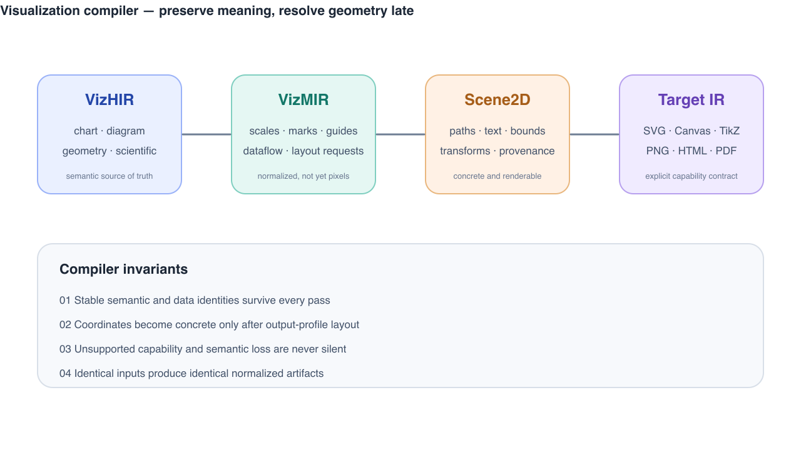

# VizIR

VizIR is an experimental, deterministic visualization compiler. Its editable
source is a semantic `.viz.yaml` document; generated MIR and Scene2D are
inspectable build artifacts.

```text
VizHIR -> validated document -> VizMIR -> Scene2D -> capability report -> target
```

The MVP deliberately supports three dialect families instead of pretending one
renderer can understand every visual system:

- `chart.scatter`, `chart.line`, `chart.bar`, explicit `chart.area` from VizHIR 0.3,
  and categorical `chart.heatmap` from VizHIR 0.4;
- `diagram.graph` with deterministic layered or manual layout;
- `geometry.scene` with typed groups, shapes, text, paths, and transforms.

PNG is a first-class delivery format and defaults to a transparent background.
SVG remains the exact, inspectable target. PNG rasterization uses
`rsvg-convert`, with ImageMagick as a fallback.

## Quick start

```bash
just install

cargo run -p vizir-cli -- validate examples/chart/service-health.viz.yaml

cargo run -p vizir-cli -- normalize \
  examples/chart/service-health.viz.yaml \
  --output out/service-health.mir.json

cargo run -p vizir-cli -- render \
  examples/chart/service-health.viz.yaml \
  --format png \
  --background transparent \
  --output out/service-health.png \
  --manifest out/service-health.manifest.json
```

Use `vizir explain <file> --node <stable-id>` to inspect why a Scene2D node
exists, and `vizir capabilities <backend>` to inspect output support.

### Optional grid composition

[CompositionV1](docs/composition.md) assigns equal grid cells to frame-free chart,
diagram, and geometry panels, then emits ordinary VizHIR 0.2. Existing absolute
frames and APIs remain unchanged. It allocates frames without auto-fit, scaling,
or clipping; one column or one row also provides a stack.

```sh
cargo run -q -p vizir-cli -- compose examples/composition/service-grid.compose.yaml --output /tmp/service-grid.viz.json
cargo run -q -p vizir-cli -- render /tmp/service-grid.viz.json --format png --output /tmp/service-grid.png
```

`just composition-demo` runs this pipeline into the Cargo target directory.
The independent input schema is available through `vizir schema composition`.

### Explicit CSV import

[`import-csv`](docs/csv-import.md) reads one bounded local CSV using a strict,
ordered type/key specification, then inserts or explicitly replaces one inline
dataset in a HIR or composition template. It emits ordinary source JSON and a
required deterministic provenance receipt. Import is an authoring step; MIR and
rendering do not acquire filesystem data sources or new versions.

```sh
cargo run -q -p vizir-cli -- import-csv examples/import-csv/area.csv \
  --template examples/import-csv/area.template.yaml --template-kind hir \
  --dataset signals --spec examples/import-csv/area.spec.json \
  --output out/import-csv/area.viz.json --provenance out/import-csv/area.provenance.json
cargo run -q -p vizir-cli -- render out/import-csv/area.viz.json --format svg \
  --output out/import-csv/area.svg
```

The [executable area and sparse-dashboard workflow](examples/import-csv/run.sh)
includes measured titles, light/dark themes, exact MIR replay, SVG and native
transparent PNG. See the [profile, limits and replacement rules](docs/csv-import.md).

### Numeric axes in VizHIR 0.2

Use `version: "0.2"` and `axis.number_format: {notation: scientific, precision: 2}`
on a numeric field encoding to request exact, locale-independent tick text.
`fixed` notation and 0–12 decimal places are also supported. Different x/y
policies lower to typed MIR guides, then ordinary Scene2D text. Full tick
labels receive shared layout envelopes; ambiguous rounded labels or an
impossible frame produce a diagnostic instead of changing precision or
clipping text. Existing documents with no format keep their legacy formatting.

See the [wire contract](docs/wire-format.md#numeric-axis-formats-in-02) and
executable examples:

- [Scientific magnitudes](examples/chart/scientific-magnitudes.viz.yaml)
- [Measurement precision](examples/chart/measurement-precision.viz.yaml)
- [Mixed axis formats](examples/chart/mixed-axis-formats.viz.yaml)

### Linear area charts in VizHIR 0.3

`chart.area` adds an explicit finite baseline and required `order: x-ascending`.
Each series fills one closed path at opacity 0.35, with preserved source rows
and keys, numeric axes and an explicit grouped legend. This first contract is
unstacked and linear; duplicate x values, missing data and unsupported options
produce diagnostics. [Area semantics and replay](docs/area-charts.md) describe
its limits and the existing theme/measured-text workflow.

- [Nonzero baseline](examples/chart/baseline-area.viz.yaml)
- [Overlapping series](examples/chart/grouped-area.viz.yaml)
- [Mixed area dashboard](examples/composition/area-dashboard.compose.yaml), using
  `vizir-composition/0.2` to emit HIR 0.3

Existing composition 0.1 continues to emit HIR 0.2.

### Stable category colors across panels in VizHIR 0.6

Set an ordered `domain` on scatter/bar `color` or line/area `series` to keep
category-to-palette assignment stable when panels observe different subsets:

```yaml
version: "0.6"
# ... ordinary document, datasets, and chart fields ...
series: {field: service, domain: [Alpha, Beta]}
```

The domain order controls palette slots and the full legend. An absent category
reserves its color and legend entry without creating rows, points, bars, lines,
or areas. Omit `domain` to retain the exact existing sorted-observed behavior.
[Domain contract and limits](docs/categorical-domains.md) ·
[Executable two-panel example](examples/composition/stable-panel-colors.compose.yaml)

Composition `vizir-composition/0.5` emits HIR/MIR 0.6. Existing source and schema
branches stay closed. This is a native CLI/compiler feature; the published
provider v1 (0.4) and v2 (0.5) profiles remain unchanged and reject 0.6.

### Shared numeric domains in VizHIR 0.7

Set exact numeric bounds on scatter/line/area `x`/`y` or bar `value` to make
cross-panel comparisons meaningful. Bounds must be finite and strictly
ascending. Every observation and the applicable area/bar baseline must fit;
outliers are rejected rather than clipped. Omission preserves old inference.

```yaml
y: {field: value, domain: [0, 10]}
```

Use HIR/MIR 0.7 or composition `vizir-composition/0.6`. Published provider
profiles remain unchanged. [Numeric domain contract](docs/numeric-domains.md) ·
[Aligned two-panel example](examples/composition/shared-numeric-domains.compose.yaml)

### Measured heatmap x-category wrapping

Opt into `vizir-text-wrap/5` and the explicit `heatmap.x_category_labels` role
to wrap long Chinese or spaced Latin categories at fixed 10px. Exact font metrics
reserve space below the cells before MIR ranges are resolved. Width, line count,
and line height are authored; overfull or unbreakable labels fail without shrinking.
[Contract and runnable example](docs/heatmap-x-wrapping.md). Published provider
profiles remain unchanged and accept wrapping profiles 1–4 only.

### Categorical heatmaps in VizHIR 0.4 and 0.5

`chart.heatmap` uses string x/y categories and finite numeric color values.
Explicit ordered category domains can reserve empty bands; missing pairs stay
empty, and present zero values keep their keyed rectangles. Quantized legends
show numeric intervals, including exact threshold and constant-domain semantics.
See [heatmap authoring, layout, limits, and replay](docs/heatmaps.md).

- [Exact present-cell labels](examples/chart/labeled-heatmap.viz.yaml), using HIR 0.5
- [Sparse matrix](examples/chart/sparse-heatmap.viz.yaml)
- [Dense matrix](examples/chart/dense-heatmap.viz.yaml)
- [Constant domain](examples/chart/constant-heatmap.viz.yaml)
- [Mixed heatmap dashboard](examples/composition/heatmap-dashboard.compose.yaml),
  using `vizir-composition/0.3` to emit HIR 0.4

HIR/MIR 0.5 adds optional `value_labels: {}` for every present cell; composition
0.4 emits that version. Numeric labels preserve typed Int64 precision, use exact
cell-fill contrast, and fail if fixed-size text cannot fit. Missing pairs remain
empty. The direct CLI and measured-font paths share the existing renderer.
The original provider v1 remains 0.4-only; separate provider v2 replays exact
measured 0.5 bundles (see [native provider contracts](docs/plot-provider.md)).

Existing HIR/MIR 0.1–0.4 and composition 0.1–0.3 keep their versioned contracts.
New runtime enum variants may require updates to exhaustive Rust matches; use
versioned root schemas for the new mark and panel variants.

### Output path safety

`normalize`, `lower`, and `render` reject an output that refers to their input.
`render --manifest` also rejects a manifest that refers to the input or rendered
artifact. The read-only preflight runs before creating destination directories
or writing any artifact, including before PNG rasterization. A collision reports
`VIZ-PATH-0001`; a path that cannot be inspected reports `VIZ-PATH-0002`.

Checks include relative/absolute spellings, existing symlinks and hard links,
symlinked parent directories, and dangling symlinks to new destinations. Missing
parents are projected without creating them, respecting symlinks before `..`.
Distinct destinations still support automatic parent creation and overwriting
an existing artifact; JSON output to stdout is unchanged.

This is protection against accidental path collisions, not a filesystem security
boundary. Concurrent path/link changes after the preflight can invalidate the
check. Checks rely on the filesystem's path resolution and file identities;
they do not predict filesystem-specific aliases between differently spelled
files that do not exist yet (for example, case folding on some volumes).

### Output publication

All file writers (`normalize`, `lower`, `schema`, SVG, PNG, render manifests,
and `import-csv` documents/receipts) first write to fresh staging directories beside their destinations (mode `0700`
on Unix; inherited access control on other platforms).
PNG rasterizers receive an absent staging path, never the final output, and that
fresh artifact must pass the complete PNG and alpha checks before publication.
A renderer that exits successfully without writing cannot reuse an old PNG.
Compilation, provider selection, rendering, validation, or manifest serialization
failure leaves existing artifact and manifest contents untouched; absent outputs
remain absent. Render manifests record the requested output path; CSV import
receipts are path-free and have their own [bounded paired-output contract](docs/csv-import.md#path-safety-and-publication).

After staging succeeds, every destination and required backup is prepared before
any final file changes. Ordinary files are replaced by same-directory rename;
existing leaf symlinks remain links and their resolved targets are updated.
Multiply hardlinked files are copied in place to preserve their shared inode,
with an independent readable backup for rollback. On Unix and Windows the link
count selects this behavior; other platforms conservatively copy in place.
Ordinary write-only files can use a hardlink backup without reading their contents.
An unreadable multiply linked file, or an ordinary file that cannot be backed up
by either hardlink or copy, is rejected before any final file changes. Existing
file write permission is required even when rename would otherwise be possible.
Existing Unix read/write/execute permission bits and platform permission flags
are preserved; special bits remain subject to OS write semantics. Ownership,
ACLs, and extended attributes are not promised across rename replacement.
Destination directories must permit
staging; their permissions are never changed. Newly created parent directories
may remain after a failed command.

If a publication operation fails, VizIR attempts to restore all destinations it
changed, including the partially copied hardlinked file. Success messages appear
only after the artifact and optional manifest are published. If rollback itself
fails (for example, because the filesystem becomes unwritable), `VIZ-OUTPUT-0001`
reports the failure and retained recovery directories; it does not claim that
old contents were restored. Normal success and handled failures clean staging.

This is not a multi-file atomic or crash-durable transaction: readers may observe
the new artifact before its manifest, and hardlink updates may expose partial
bytes. Crashes, forced termination, power loss, concurrent writers, path/link
changes, and external processes that keep modifying staged files are outside
the guarantee. A crash can leave mixed versions and staging/backup directories;
there is no automatic crash recovery or directory `fsync` durability guarantee.

### PNG alpha validation

The default `--background transparent` requires at least one fully transparent
pixel (alpha zero) and at least one visible pixel (nonzero alpha). Validation
uses decoded samples, including 8/16-bit RGBA and grayscale-alpha, low-bit
indexed palettes, and grayscale/RGB `tRNS` transparency. Full 16-bit precision
is preserved: alpha `0x0001` is visible. An alpha-capable file containing only
opaque pixels or only fully transparent pixels does not meet this contract.

Explicit hex backgrounds (`#RRGGBB` or `#RRGGBBAA`) do not require a transparent
pixel or an alpha channel; RGB, grayscale, and indexed PNGs without transparency
are valid opaque encodings. An eight-digit background may itself be translucent,
so specifying a hex background is not an assertion that every pixel is opaque.
Every mode must decode the pixels and finish the PNG stream, including IEND/CRC
validation. Both rasterizer routes use the same checks.

### PNG verification resource limits

PNG verification accepts at most **16,777,216 pixels** (`width × height`) and
**134,217,728 decoded bytes** (128 MiB) per image. The byte budget includes all
channels after palette, packed grayscale, and `tRNS` expansion, and preserves
16-bit samples: RGBA8 needs four bytes per pixel, RGBA16 needs eight. These
limits apply to both renderer routes and every background mode.

The PNG library reads the IHDR first; checked dimension arithmetic rejects
over-budget images before further metadata and pixel-buffer allocation. After
metadata determines the expanded sample format, checked byte arithmetic and a
fallible reservation guard the caller's decoded buffer. These failures report
`VIZ-ARTIFACT-0004` and leave existing output and manifest contents unchanged.
For a valid but over-budget IHDR, this resource diagnostic takes priority over
later missing/corrupt pixels or stream chunks. Within-budget invalid streams
still report `VIZ-ARTIFACT-0001`; complete decoding and alpha checks remain
required for success.

The decoder retains its separate 64 MiB internal allocation limit. The caps are
verification maxima, not a guarantee that every image shape below them can be
decoded or a total-process memory bound. Allocator overhead, decoder state,
and external rasterizer memory are separate; rasterization happens before
artifact verification. Scene/SVG dimensions are not newly capped, and do not
imply support for arbitrarily large PNGs.

### External renderer limits

PNG selection still prefers `rsvg-convert`, falling back to ImageMagick (`magick`)
when its probe is unavailable or unsuccessful. Each `--version` probe has a
2-second deadline, and the selected rasterizer has a 30-second deadline. The
manifest records that successful selection without launching another probe. A
failed selected renderer is an error, not a request to retry with another backend.

Each deadline covers both direct-child exit and completion of stdout/stderr
capture. Stdin is closed. At most 64 KiB of raw diagnostic bytes are retained
per stream; excess bytes are drained and discarded, with a truncation marker in
reported diagnostics. Both streams are drained in bounded chunks so a flood
cannot prevent deadline checks. Captures use nonblocking reads on Unix and
available-byte reads on Windows, without detached reader threads.

After direct-child exit, inherited diagnostic pipes get at most 250 ms to close,
within the original deadline. A timeout, capture failure, or held-open pipe is an
error even if a PNG was written. On cancellation, only the owned direct child is
killed, followed by up to 250 ms of nonblocking reap attempts; a cleanup failure
is reported. Descendants are not killed and may survive after their capture
handles close. No process groups, global signal handlers, or global environment
changes are used. Deadlines are polling bounds (5 ms interval), with cancellation
grace and normal OS scheduling/spawn overhead, not hard real-time guarantees.

Success also requires a zero exit status and a decodable, complete fresh PNG
passing the alpha contract. Failed and timed-out renders discard their staging
without changing existing output or manifest contents. See Output publication
above for publication rollback and crash/concurrency limits.

The executable contracts can be emitted directly from the Rust model:

```bash
vizir schema mir --output schemas/viz-mir.schema.json
vizir schema scene-patch --output schemas/scene-patch.schema.json
vizir schema capability --output schemas/capability.schema.json
```

### Numeric chart fields

Line, scatter, and bar numeric fields must contain finite numbers. A field
whose finite maximum minus minimum overflows is rejected before normalization
with `VIZ-TYPE-0106`; rescale the input values to a smaller magnitude. This
prevents that overflowing span from producing invalid domains or coordinates.
This check does not promise arbitrary-magnitude arithmetic or constrain every
possible derived-domain operation.

### Chart header layout

Chart titles, legends, and axis titles reserve space before scales are resolved.
Short legends retain the compact positions when they fit; otherwise all entries
flow onto width-aware rows below the title. Plot ranges and Scene2D use the same
layout, and stable label IDs, full text, category order, and colors are retained.

Header widths use conservative, deterministic advance estimates for the default
sans-serif stack, not measured glyph bounds or font shaping. Wide Latin letters
reserve more space than narrow ones; each non-ASCII code point, including a
combining mark, reserves 1.2 em. Font substitution can still affect rendered
metrics, so inspect the final artifact at delivery size. Text is never silently
truncated, hidden, or reduced to make a header fit.

An individual overwide title/legend/axis title, or a frame that cannot retain a
64-by-64 scene-unit plot after header and axis insets, fails with
`VIZ-LAYOUT-0004`. Enlarge the frame or edit the text. This happens before output
publication. Persisted MIR whose scale ranges no longer match this layout fails
with `VIZ-LAYOUT-0005`; normalize it again from its VizHIR source. Range checks
allow only floating-point roundoff from serialization and recomputation; guides
then use the same stored endpoints as marks.

## Explicit MIR guide references

`MirGuide.scale` selects the axis or legend scale by its exact ID; IDs have no
required suffix. A guide may refer to a different scale from the mark, so its
own domain supplies tick/category labels or legend labels and swatches. Spatial
guide ranges must match the chart's resolved plot, with the same roundoff-only
allowance as mark ranges. Explicit legend scales also own header allocation.

Missing guide-scale references fail with `VIZ-RESOLVE-0006`, and incompatible
scale kinds fail with `VIZ-TYPE-0203`. The static scene builder supports one
bottom linear/band axis, one left linear axis, and one right-oriented color
legend (using the existing header placement). Unsupported combinations or
multiple guides in one slot fail with `VIZ-SCENE-0004`; this does not add top or
right axes, left band axes, or new legend placement styles.

An absent axis guide emits no corresponding axis or grid. For compatibility,
0.1 MIR without an explicit legend retains its implicit mark-color legend;
line/bar normalization currently uses this form. An explicit legend always
takes precedence over that fallback. Canonical VizHIR and generated MIR/schema
bytes are unchanged by this reference-resolution rule.

## Current boundary

VizIR owns schema validation, normalization, lowering, layout, stable identity,
provenance, capability reporting, Scene2D construction, and artifact emission.
It does not own natural-language intent interpretation or backend routing; that
remains the responsibility of the `create-plot` skill.

A separate, opt-in [HTML explorer](docs/html-explorer.md) adds a document camera,
source inspection and single Scene-node selection over the existing SVG. Its
real-browser/DOM acceptance gate remains blocked; native tests are separate.
An additional [linked-selection profile](docs/linked-selection.md) uses only
explicit, snapshot-bound groups of exact Scene-node IDs.
The broader interaction/dataflow roadmap, animation, Scene3D, external layout
providers, native TikZ and large columnar instance buffers remain separate work.

See [the IR family contract](docs/ir-family.md) for the ownership boundary,
stable 0.1 surface, and promotion rules.

See [static MIR materialization](docs/materialization.md) for executable numeric
bindings, checked instance caches, and the explicit `rematerialize_mir` API.

See [backend negotiation](docs/backend-capabilities.md) for exact Scene2D
identity aliases, advertised node/clip limits, and fail-closed report semantics.

Scene construction, diff, patch application, and SVG/PNG emission enforce
[bounded Scene2D validation](docs/ir-family.md#bounded-scene2d-validation),
including global stable identity and transactional patch checks.

## Executable reference gallery

Every gallery PNG is built from the adjacent semantic example and retains a
transparent alpha channel. These are scenario references, not isolated shape
smokes.

| Scenario | Semantic source | Rendered reference |
| --- | --- | --- |
| Service reliability dashboard | `examples/chart/service-health.viz.yaml` | `gallery/service-health.png` |
| Multi-series incident recovery | `examples/chart/incident-latency.viz.yaml` | `gallery/incident-latency.png` |
| Model evaluation comparison | `examples/chart/model-evaluation.viz.yaml` | `gallery/model-evaluation.png` |
| Regional revenue bindings | `examples/chart/sales-regions.viz.yaml` | `gallery/sales-regions.png` |
| Agent compiler runtime | `examples/diagram/agent-runtime.viz.yaml` | `gallery/agent-runtime.png` |
| Streaming data platform | `examples/diagram/data-platform.viz.yaml` | `gallery/data-platform.png` |
| Automatic dialect lowering layout | `examples/diagram/dialect-lowering.viz.yaml` | `gallery/dialect-lowering.png` |
| Compiler invariant poster | `examples/geometry/compiler-pipeline.viz.yaml` | `gallery/compiler-pipeline.png` |
| Visual grammar map | `examples/geometry/visual-grammar.viz.yaml` | `gallery/visual-grammar.png` |
| Mixed reliability brief | `examples/mixed/reliability-brief.viz.yaml` | `gallery/reliability-brief.png` |
| Mixed capacity planning brief | `examples/mixed/capacity-planning.viz.yaml` | `gallery/capacity-planning.png` |

Run `just gallery` to regenerate every PNG and the searchable, self-contained
[`gallery.html`](gallery.html); `just gallery-check` verifies it is current.





## Canonical themes (explicit opt-in)

Use `vizir themes` to list the fourteen canonical family/mode names.
`vizir normalize source.viz.yaml --theme azure-dark -o themed.mir.json`
persists a versioned theme compilation context that existing validate, lower,
render and explain commands can reload. `normalize themed.mir.json` refreshes
intentionally edited MIR data while preserving the pinned theme and styles.
Omitting the selector retains legacy output bytes. See [theme context and defaults](docs/themes.md).

### Measured single-line text (opt-in)

Use exact supplied font bytes with the durable compilation context for font-independent outlines. See [the complete CLI/composition example and limits](docs/measured-text.md). Legacy native text and themed-mir/1 remain unchanged. Rust 1.89 or newer is required; no font installation is performed.

### Explicit geometry text wrapping (opt-in)

Add a source-targeted `--text-layout` policy to measured text for bounded Latin/CJK paragraphs, preserved whitespace and explicit hard breaks. See [the executable three-panel composition, font resources, and exact wrapping contract](docs/wrapping.md). Chart and diagram text retain their single-line behavior.

### Measured chart-title blocks (explicit role)

`vizir-text-wrap/2` adds `chart.title` semantic targets for bar, line and scatter
charts, area charts from HIR/MIR 0.3, and heatmaps from HIR/MIR 0.4. Heatmap
category and legend wrapping remain deferred. Titles reserve their full measured
height before plot ranges and legend
positions are fixed. See [the narrow three-chart composition](examples/composition/wrapped-chart-titles.compose.yaml)
and [versioned policy/CLI instructions](docs/wrapping.md#semantic-chart-titles-vizir-text-wrap2).

### Complete bar-category labels (explicit role)

`vizir-text-wrap/3` selects the entire bar category domain by source role, with
fixed10px text, measured per-cell wrapping and bottom allocation before ranges.
Values and domain order remain unchanged. See [the two-panel category example](examples/composition/wrapped-bar-categories.compose.yaml)
and [the versioned policy contract](docs/wrapping.md#bar-category-labels-vizir-text-wrap3).

### Selected diagram node labels

`vizir-text-wrap/4` selects exact source diagram nodes. Fixed 13px Medium labels
wrap and center their complete measured blocks inside the existing nodes.
See [the mixed-role composition](examples/composition/wrapped-diagram-nodes.compose.yaml),
[explicit policy](examples/text/diagram-node-layout.json), and
[wrapping contract](docs/wrapping.md#selected-diagram-node-labels-vizir-text-wrap4).

## Prepared-bundle provider

The optional [native compiled SVG provider](docs/plot-provider.md),
`plot-provider-vizir`, replays a complete measured MIR 0.4 bundle via
`render-compiled-svg`, or a MIR 0.5 bundle via the separate
`render-compiled-svg-v2` command, with explicit
raw resource pins and emits SVG plus a mandatory path-free native receipt.
It reuses the existing compiler/backend; independent Hub receipt verification
is a separate integration requirement. Build/install now includes both binaries;
`cargo run -p vizir-cli -- ...` continues to select `vizir`.
